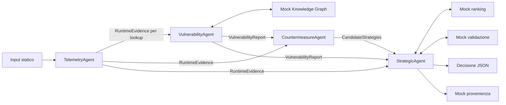

# Thesis Agents — primo prototipo CAMEL

Il progetto realizza: quattro ruoli CAMEL, messaggi JSON validati con Pydantic e dipendenze esterne sostituite da tool Python locali.



## Avvio

Usa **Python 3.11 o 3.12**. In questa workspace è già presente `.venv`, creata con Python 3.12.

```bash
python3.12 -m venv .venv
source .venv/bin/activate
python -m pip install -e '.[dev]'
```

Per verificare subito il caso statico, senza credenziali e senza chiamate LLM:

```bash
python main.py --mode fixtures
```

Questa modalità esercita gli stessi contratti e tool della Workforce usando output prefissati. **Non è un'esecuzione degli agenti**: anche la provenienza riporta `mode: fixtures` e ruoli `fixture:*`.

Per eseguire gli agenti CAMEL:

```bash
cp .env.example .env
# Imposta LLM_MODEL, LLM_API_KEY ed eventualmente LLM_BASE_URL nel file .env.
python main.py
```

Il modello scelto deve supportare tool calling e risposte JSON. `LLM_BASE_URL` consente di usare un endpoint compatibile, anche locale; per un server locale senza autenticazione imposta una chiave fittizia esplicita. Non è previsto un modello implicito e le credenziali non vengono salvate negli artefatti.

### LLM locale con Ollama, senza costi API

Con Ollama avviato e `qwen3:4b-instruct` installato, crea il profilo locale con contesto
a 16K token (riusa i pesi esistenti):

```bash
ollama create tesi-qwen3:4b -f Modelfile
```

Se il modello non è presente, scaricalo prima con `ollama pull qwen3:4b-instruct`.
Configura `.env`:

```dotenv
LLM_MODEL=tesi-qwen3:4b
LLM_API_KEY=local
LLM_BASE_URL=http://localhost:11434/v1
LLM_TIMEOUT_SECONDS=300
LLM_TEMPERATURE=0
```

Avvia `python main.py --mode camel --workflow pipeline`. Il valore `local` è
una credenziale fittizia per il client compatibile OpenAI: l'inferenza avviene
su Ollama, senza utilizzare la chiave OpenAI. È un'esecuzione LLM reale dei
quattro agenti CAMEL; i tool di dominio restano mock. Velocità e affidabilità
dipendono dal modello e dalle risorse locali. Le variabili già esportate nella
shell prevalgono su `.env`: rimuovi eventuali impostazioni di un provider cloud
prima di usare questa configurazione.

La temperatura viene inviata esplicitamente all'endpoint: non si presume che
il default dell'API compatibile coincida con quello del Modelfile. Lascia
`LLM_TEMPERATURE` vuota per provider che non supportano questo parametro.

La prima esecuzione completa verificata con `tesi-qwen3:4b` è descritta nel
[resoconto della prova Ollama](docs/ollama-first-run.md). Lo Strategic ha richiesto
un tentativo aggiuntivo per pubblicare decisione e provenienza. Il successo va
verificato sugli otto artefatti validati, non sui soli messaggi dei worker; un run
riuscito non dimostra l'affidabilità del modello su altri casi.

Per diagnosticare le chiamate puoi impostare `CAMEL_MODEL_LOG_ENABLED=true` e
`CAMEL_LOG_DIR=output/llm-logs` prima dell'avvio. I log SDK contengono prompt,
risposte e messaggi dei tool; sono distinti dall'artefatto di provenienza di dominio.

Ogni esecuzione crea una cartella distinta `output/<timestamp>-<id>/`. Puoi specificare `--input percorso/caso.json` e `--output percorso/cartella-vuota`. Una cartella non vuota viene rifiutata per preservare le esecuzioni precedenti.

## Cosa è implementato

| Componente | Comportamento nel prototipo |
|---|---|
| TelemetryAgent | Normalizza l'input statico; la pubblicazione verifica che i fatti siano preservati |
| VulnerabilityAgent | Interroga il tool e pubblica il rapporto senza modificare CVE, fonte o punteggi |
| CountermeasureAgent | Genera strategie, motivazioni e stime di beneficio/impatto tramite il modello |
| StrategicAgent | Invoca costruzione del grafo, ranking, validazione in ordine e registrazione della decisione |
| Mock KG | Corrispondenza esatta `log4j-core` / `2.14.1` → fixture `CVE-2021-44228` |
| Mock ranking | Somma pesata deterministica a un passo; **non implementa l'algoritmo BWAF reale** |
| Mock semantico | Controlla capacità disponibili e azioni proibite; **non implementa Tiny-ME** |
| Mock provenienza | Registra input, hash SHA-256, attività e ruoli in JSON locale; nessuna transazione Fabric |

Il grafo esplicita, per ogni strategia, un argomento strategia, un supporto per il beneficio e un attacco per l'impatto operativo. Il tool applica:

```text
score = clamp(0.5 + 0.5 × security_benefit − 0.5 × operational_impact, 0, 1)
```

I pareggi vengono risolti per ID. La formula serve a esercitare il contratto del ranking. Le stime candidate sono generate dal modello nella modalità CAMEL: ranking deterministico non significa che l'intera esecuzione LLM sia riproducibile o che tali stime siano oggettive.

La Workforce predefinita usa la modalità CAMEL `PIPELINE`: quattro task assegnati ed eseguiti da CAMEL con un DAG esplicito. `vulnerability` dipende da `telemetry` per il lookup; `countermeasure` dipende da entrambi; `strategic` dipende direttamente da tutti e tre. L'ordine di esecuzione resta vincolato da questi prerequisiti, ma ogni artefatto mantiene la propria identità e disponibilità. Lo StrategicAgent legge separatamente `RuntimeEvidence`, `VulnerabilityReport` e `CandidateStrategies` tramite `get_context`, che espone anche `artifact_producers`. Per sperimentare anche la decomposizione tramite il task agent:

```bash
python main.py --workflow auto
```

Il coordinatore e il task agent sono componenti gestionali CAMEL, oltre ai quattro ruoli di dominio. Gli agenti condividono gli artefatti validati tramite `get_context`; il risultato testuale di un task non è fonte autorevole per il dominio. Le pubblicazioni avvengono con tool che validano JSON/Pydantic e impediscono modifiche incompatibili. La modalità `auto` conserva gli stessi vincoli sui dati, ma richiede una valutazione con il modello scelto.

## Artefatti prodotti

Oltre a `input.json`, copia dell'input validato:

1. `runtime_evidence.json`
2. `vulnerability_report.json`
3. `candidate_strategies.json`
4. `argumentation_graph.json`
5. `ranking.json`
6. `semantic_validation.json` — conserva anche i tentativi rifiutati
7. `final_decision.json`
8. `provenance.json`

Il caso fixture seleziona `S_UPGRADE`, con score `0.875`. Rimuovendo `maintenance_window` dalle capacità dell'input, l'upgrade viene rifiutato e si passa a `S_ISOLATE`. Con tutte le capacità assenti l'esito è `no_valid_strategy`. Un pacchetto/versione non coperto dalla fixture produce `insufficient_evidence`: l'assenza di una corrispondenza non equivale all'assenza di vulnerabilità.

Nessuna contromisura viene eseguita. `selected` indica una proposta che supera i controlli del mock, non una remediation effettuata o una prova semantica completa. Il campo `constraints` contiene caveat testuali; il validatore locale controlla soltanto `prerequisites`, requisiti propri delle categorie di azione e `prohibited_actions`.

## Contratti e struttura

Per studiare il codice, parti dalla [guida alla lettura dei file commentati](docs/reading-guide.md). I sorgenti contengono spiegazioni in italiano; il [caso JSON è documentato campo per campo](thesis_agents/data/README.md) senza alterarne il formato.

```text
main.py                         # Entry point dalla cartella del progetto
thesis_agents/
  agents/                       # Prompt e tool dei quattro ruoli CAMEL
  schemas/                      # Contratti Pydantic, senza dipendenze CAMEL
  tools/interfaces.py           # Protocol per sostituire i backend
  tools/*_mock.py               # Implementazioni locali
  orchestration/artifacts.py    # Stato condiviso e pubblicazioni validate
  orchestration/workforce.py    # Workforce, task e dipendenze CAMEL
  data/log4j_case.json          # Input iniziale
  config.py                     # Configurazione del backend LLM
  fixtures.py                   # Solo dimostrazione dei contratti senza LLM
tests/                          # Contratti, CLI e integrazione CAMEL
```

I contratti e i punti di sostituzione sono descritti in [docs/architecture.md](docs/architecture.md). Per esportare i JSON Schema senza credenziali:

```bash
python main.py --export-schemas output/schemas
```

## Verifiche

```bash
python -m pytest -q
ruff check .
ruff format --check .
python -m pip check
```

I test verificano il caso completo, il fallback dopo un rifiuto, tutti i candidati rifiutati, lookup sconosciuti, riferimenti e stime invalidi, integrità della provenienza, pubblicazioni immutabili e protezione da esiti inventati. Il test di integrazione esegue la **Workforce CAMEL reale con un backend LLM a risposte programmate**, verificando tool calling e passaggio fra i quattro ruoli, senza rete. Non misura la qualità della generazione e non sostituisce un test con un LLM effettivo.

CAMEL è fissato a `0.2.90`; MCP è limitato alla serie 1 perché la serie 2 risolta inizialmente rendeva impossibile importare `FastMCP` da CAMEL. OpenAI SDK è limitato alla serie 1/2 verificata nel progetto. Per riprodurre le versioni usate nei test, installa prima `requirements.lock` e poi il progetto con `python -m pip install --no-deps -e .`.

Riferimenti tecnici: [Workforce CAMEL](https://docs.camel-ai.org/key_modules/workforce), [API Workforce e modalità pipeline](https://docs.camel-ai.org/reference/camel.societies.workforce.workforce), [ChatAgent e output strutturati](https://docs.camel-ai.org/key_modules/agents). La fixture riprende i dati esemplificativi della chat; non è un feed aggiornato di vulnerabilità.
