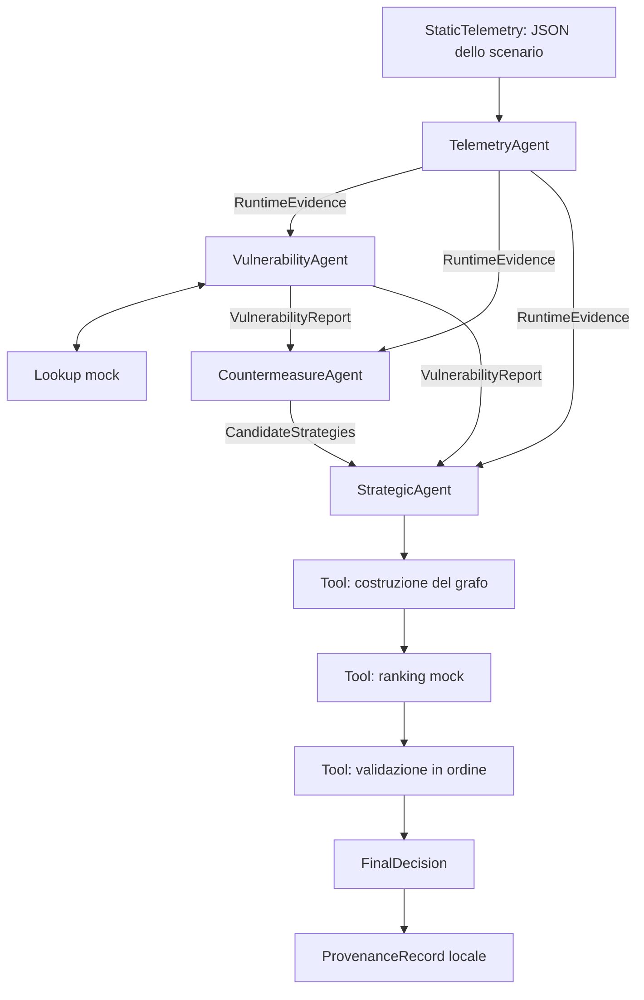

# Prototipo multi-agente per Agentic CTI

**Prima relazione tecnica — 17 settembre 2026**  
Repository: `tesi`; package Python: `thesis_agents`.

Questo documento descrive il prototipo realizzato, le motivazioni delle scelte,
il funzionamento del codice e le prove conservate nel repository e nella
workspace. È una prima base per la presentazione al docente e per la successiva
stesura della tesi. La descrizione teorica riguarda il modello adottato nel
prototipo; non costituisce una rassegna bibliografica né una specifica già
verificata dei repository esterni da integrare.

## 1. Obiettivo e stato del lavoro

Il progetto studia un flusso di supporto alla decisione nel quale informazioni
sull'esecuzione di un servizio vengono correlate a vulnerabilità note. A partire
da queste evidenze, un agente propone contromisure; un agente strategico usa
strumenti di ranking e validazione per individuare una proposta compatibile con
le capacità e le policy dello scenario, conservandone la provenienza.

Il mockup è un prototipo eseguibile: i quattro agenti CAMEL utilizzano realmente
un LLM locale e invocano tool Python. Le integrazioni esterne sono rappresentate
da backend mock, con interfacce esplicite e risultati validati. Nessuna
contromisura viene applicata all'infrastruttura.

Al termine della matrice del 16 settembre, ricontrollata il 17 settembre,
sono disponibili **otto esecuzioni complete e verificate su otto**, due per
ciascuno dei quattro scenari. La suite automatica eseguita prima della matrice
ha superato **95 test**. Questo risultato riguarda i casi e la configurazione
provati; non misura l'affidabilità generale del sistema.

## 2. Principi del modello

### 2.1 Evidenza, conoscenza, proposta e decisione

Il flusso distingue quattro responsabilità:

1. **Osservare:** rappresentare software, versione e condizioni runtime.
2. **Correlare:** cercare vulnerabilità associate al software osservato.
3. **Proporre:** generare alternative e stime di beneficio e impatto.
4. **Decidere:** ordinare le alternative, verificarne l'ammissibilità e motivare
   una selezione oppure un esito senza selezione.

Una correlazione di vulnerabilità non dimostra che sia avvenuto un exploit.
Una strategia proposta non è una strategia eseguita. Una stima generata dal
modello non è una misura empirica. Queste distinzioni determinano i contratti
degli artefatti e il significato degli esiti finali.

### 2.2 Agenti generativi e controlli deterministici

Nel prototipo un agente combina istruzioni di ruolo, un modello LLM, un insieme
di tool e un contesto di esecuzione gestito da CAMEL. L'LLM interpreta il task,
sceglie le chiamate consentite e produce gli argomenti. Il codice Python esegue
le operazioni e valida i dati proposti.

Questa separazione consente di usare la generazione linguistica per formulare
strategie e coordinare i passaggi, mantenendo controlli ripetibili sui fatti
critici, sui riferimenti e sulle condizioni di selezione. Il modello non può
rendere valida una strategia rifiutata semplicemente dichiarandola accettata.
Rimane possibile che produca descrizioni imprecise o chiamate errate: i controlli
limitano gli effetti sullo stato autorevole senza dimostrare la correttezza di
ogni frase generata.

### 2.3 Artefatti e DAG

Un artefatto è un risultato di dominio tipizzato, pubblicato attraverso un tool,
conservato nella sessione e serializzato in JSON. È distinto dal messaggio
conversazionale o dal riepilogo con cui un worker conclude un task CAMEL.

Le dipendenze sono descritte da un grafo diretto aciclico, o DAG. Un arco indica
che un task richiede i dati di un produttore precedente; non indica che il nuovo
risultato cancelli o riassuma autoritativamente quello precedente. Nel caso
attuale i prerequisiti portano a un ordine sequenziale, ma i tre artefatti
strategici conservano identità, contenuto e produttore distinti.

## 3. Architettura implementata



| Task | Prerequisiti diretti | Pubblicazione principale |
|---|---|---|
| `telemetry` | nessuno | `RuntimeEvidence` |
| `vulnerability` | `telemetry` | `VulnerabilityReport` |
| `countermeasure` | `telemetry`, `vulnerability` | `CandidateStrategies` |
| `strategic` | tutti e tre i produttori | Grafo, ranking, validazioni, decisione, provenienza |

La dipendenza Telemetry → Vulnerability è necessaria: il lookup deve conoscere
il pacchetto e la versione effettivamente osservati. Il report delle vulnerabilità
non incorpora né sostituisce l'evidenza runtime. Il CountermeasureAgent usa
entrambi; lo Strategic legge separatamente i tre output mediante `get_context`.

La modalità predefinita è `pipeline`. Il codice fornisce a CAMEL task e dipendenze
con `pipeline_add(..., auto_depend=False)` e `pipeline_build()`. L'opzione
`--workflow auto` delega la decomposizione al framework, mantenendo i controlli
sugli artefatti, ma non è la modalità valutata nella matrice qui presentata.

Fonte implementativa: [workforce.py](../thesis_agents/orchestration/workforce.py).

## 4. Come vengono usati CAMEL e l'LLM

### 4.1 Dichiarazione degli agenti

I file [agents/](../thesis_agents/agents/) definiscono `PROMPT` e `TOOLS` dei
quattro ruoli. Gli oggetti CAMEL sono creati in `build_workforce`, non nei moduli
dei prompt. Il seguente estratto ridotto mostra la costruzione:

```python
agent = ChatAgent(
    system_message=BaseMessage.make_assistant_message(
        role_name=role, content=COMMON + "\n" + module.PROMPT
    ),
    model=backend_factory(),
    tools=[publications.resolve(name) for name in module.TOOLS],
    max_iteration=20,
    retry_attempts=1,
    step_timeout=300,
)
workforce.add_single_agent_worker(
    description=f"{role}: {module.PROMPT}",
    worker=agent,
    pool_max_size=1,
    enable_workflow_memory=False,
)
```

Ogni ruolo riceve i propri tool. Per esempio, il CountermeasureAgent pubblica
strategie ma non possiede il tool per pubblicare la decisione finale. La
Workforce gestisce assegnazione, esecuzione, risultati e recuperi. Sono presenti
anche componenti gestionali CAMEL, fra cui coordinatore e task agent: non sono
ulteriori produttori di evidenze di dominio, ma contribuiscono alle richieste LLM.

Le memorie conversazionali dei worker non sono condivise (`share_memory=False`).
Lo stato di dominio comune è la stessa `ArtifactSession`, accessibile attraverso
i metodi associati ai tool.

### 4.2 Ruolo del modello per ciascun agente

| Agente | Uso dell'LLM | Vincolo imposto dal codice |
|---|---|---|
| Telemetry | Legge il caso e propone l'evidenza strutturata | Identità software e fatti critici devono coincidere con l'input |
| Vulnerability | Invoca il lookup e pubblica il report | Il report deve coincidere con il risultato del tool |
| Countermeasure | Genera alternative, motivazioni, prerequisiti e stime | Schema valido e riferimenti a CVE presenti nel report |
| Strategic | Legge i tre input, invoca i tool in sequenza e propone la selezione | Ranking, tentativi semantici e selezione devono essere coerenti |

Il contributo generativo principale riguarda le candidate strategies. Le
trasformazioni di Telemetry e Vulnerability sono più vincolate, ma nel percorso
CAMEL sono comunque eseguite da agenti che effettuano chiamate reali al modello.
La formula di ranking e il controllo delle capacità non sono calcolati dall'LLM.

### 4.3 Backend di inferenza locale

[config.py](../thesis_agents/config.py) costruisce il backend con
`ModelFactory.create`. L'endpoint Ollama espone un'API compatibile con il client
usato dall'SDK; l'impiego dell'SDK OpenAI come client non significa che le
richieste vadano al servizio cloud OpenAI.

La configurazione valutata usa `tesi-qwen3:4b`, derivato da `qwen3:4b-instruct`,
con profilo in [Modelfile](../Modelfile), contesto configurato a 16.384 token e
temperatura 0. Il limite di 2048 token riguarda invece ciascuna risposta.
Le due grandezze non coincidono. Temperatura 0 non garantisce esecuzioni identiche.

## 5. Stato condiviso, artefatti e validazione

### 5.1 ArtifactSession e get_context

[ArtifactSession](../thesis_agents/orchestration/artifacts.py) mantiene modelli
Pydantic in memoria, conserva copie profonde e scrive i file pubblicati. Una
pubblicazione identica può essere ripetuta; una riscrittura differente viene
rifiutata. Il report semantico è accumulato progressivamente, perché deve
registrare anche i tentativi rifiutati.

`get_context()` restituisce input e artefatti sotto chiavi distinte, gli schemi
delle tre pubblicazioni principali e `artifact_producers`. Lo Strategic legge:

```text
artifacts.runtime_evidence       → TelemetryAgent
artifacts.vulnerability_report   → VulnerabilityAgent
artifacts.candidate_strategies   → CountermeasureAgent
```

I produttori sono metadati dichiarati dal prototipo, non identità certificate
crittograficamente. In modalità fixture hanno il prefisso `fixture:`.

### 5.2 File prodotti

Oltre alla copia `input.json`, ogni esecuzione completa produce otto output:

| File | Contenuto e significato |
|---|---|
| `runtime_evidence.json` | Servizio, software/versione, ID dell'evidenza e fatti runtime |
| `vulnerability_report.json` | Esito del lookup e finding con riferimenti all'evidenza |
| `candidate_strategies.json` | Alternative, categorie di azione, stime e prerequisiti |
| `argumentation_graph.json` | Proiezione delle candidate in nodi e relazioni |
| `ranking.json` | Ordine e punteggi restituiti dal backend |
| `semantic_validation.json` | Tentativi di validazione, rifiuti e relativo motivo |
| `final_decision.json` | Selezione o esito senza selezione, spiegazione e fonti |
| `provenance.json` | Entità, hash dei file, attività e ruoli del run |

### 5.3 Dove interviene Pydantic

I modelli sono in [schemas/](../thesis_agents/schemas/). La classe comune
`Message` vieta campi aggiuntivi e abilita la validazione delle assegnazioni.
Alcuni campi adottano controlli più specifici: booleani `StrictBool`, ID univoci,
stime finite in `[0,1]` e coerenza fra stato della decisione e strategia selezionata.
Questo non implica che tutti i tipi usino conversioni strettamente disabilitate.

La validazione avviene in più punti:

1. La CLI costruisce `StaticTelemetry` dall'input JSON.
2. [PublicationTools](../thesis_agents/orchestration/publication_tools.py) valida
   gli oggetti proposti ai tre tool di pubblicazione.
3. I metodi della sessione leggono i payload con `model_validate_json` e
   confrontano i risultati con gli altri artefatti.
4. `require` ricostruisce un modello validato quando un consumatore lo richiede.
5. `assert_complete` controlla tutti gli output, la corrispondenza memoria/file
   e la derivazione della spiegazione finale.

I vincoli interni a un modello e quelli fra modelli sono distinti. Un CVE può
avere sintassi corretta ma non provenire dal lookup: serve il confronto della
sessione. Analogamente, Pydantic può validare una frase non vuota senza provarne
la veridicità.

### 5.4 Payload strutturati e risultato dei task

I tre tool di pubblicazione esposti a CAMEL accettano un oggetto `payload`;
l'LLM non deve generare una stringa che contenga un secondo JSON con escape.
L'adapter ricava lo schema dai modelli e serializza l'oggetto validato per
l'API della sessione. Anche un set vuoto deve essere pubblicato realmente:

```json
{"payload": {"strategies": []}}
```

[ArtifactTaskHandler](../thesis_agents/orchestration/task_results.py) adatta
il gestore di output strutturato dell'SDK. Verifica gli input prima dell'inferenza
e gli output prima di accettare un `TaskResult` con `failed=false`. Scrivere
«pubblicato» nel riepilogo non crea il relativo artefatto.

In pipeline, `ArtifactWorkforce` blocca i discendenti di un produttore fallito
definitivamente. Il recupero del produttore rimane gestito da CAMEL. Gli hook
usano API interne della versione fissata 0.2.90 e richiedono verifica in caso
di aggiornamento del framework.

## 6. Backend mock e logica della decisione

### 6.1 Lookup delle vulnerabilità

[MockVulnerabilityTool](../thesis_agents/tools/vulnerability_mock.py) contiene
una corrispondenza esatta: `log4j-core` versione `2.14.1` produce la fixture
`CVE-2021-44228`. La fonte dichiara esplicitamente che non è una query a un KG live.
Non vengono interrogati OWL CTI, OSV o feed aggiornati.

Per coppie non coperte il risultato è `unsupported`. Questo significa
informazione non disponibile nel lookup, senza attestare assenza di
vulnerabilità, stato del supporto del vendor o sicurezza del pacchetto.

### 6.2 Grafo argomentativo e ranking

Il prototipo rappresenta una candidata con un nodo strategia e due contributi:
beneficio di sicurezza come supporto e impatto operativo come attacco.
È una rappresentazione didattica di contributi favorevoli e contrari alla
proposta, non un'implementazione delle semantiche del BWAF finale.

[build_graph e MockRankingTool](../thesis_agents/tools/ranking_mock.py) applicano:

```text
score(s) = clamp(0.5 + 0.5 × beneficio(s) − 0.5 × impatto(s), 0, 1)
```

Il calcolo usa i pesi originali con un solo passo, arrotonda a otto decimali
e ordina per score decrescente; a parità di score usa l'ID. Non implementa
propagazione iterativa, risoluzione generale di cicli o smart contract.
Per la candidata upgrade delle fixture: `0.5 + 0.5×0.95 − 0.5×0.20 = 0.875`.

La funzione è deterministica rispetto alle candidate ricevute. Le stime delle
candidate CAMEL sono però generate dall'LLM: ordinamenti diversi fra run
possono essere coerenti con lo stesso algoritmo.

### 6.3 Validazione e fallback

[MockSemanticTool](../thesis_agents/tools/semantic_mock.py) confronta capacità
e policy, senza ragionamento ontologico Tiny-ME. I requisiti obbligatori sono:

| Azione | Capacità richieste dal tool |
|---|---|
| `upgrade` | `package_upgrade`, `maintenance_window` |
| `isolate` | `network_isolation` |
| `block_deployment` | `deployment_control` |
| `monitor` | `monitoring` |

Il tool unisce questi requisiti a quelli aggiuntivi della candidata, verifica
le capacità mancanti, le azioni proibite e i riferimenti alle CVE note. I caveat
nel campo libero `constraints` non vengono interpretati semanticamente.

Lo Strategic deve validare in ordine di ranking e fermarsi al primo accettato.
Un rifiuto provoca il passaggio alla candidata successiva, conservando il motivo.
La selezione è una proposta compatibile con questi controlli limitati, non una
prova che l'azione sia sufficiente o sicura in produzione.

| Stato finale | Significato nel prototipo |
|---|---|
| `selected` | Selezionato il primo candidato accettato |
| `no_valid_strategy` | Tutte le candidate pubblicate sono state rifiutate |
| `insufficient_evidence` | Lookup non coperto, senza candidate fondate sul report |

Un crash o un timeout è invece un fallimento dell'esecuzione: non è uno di
questi esiti. Con ranking vuoto non si valida un ID inesistente; la pubblicazione
della decisione senza selezione crea anche il report semantico vuoto.

### 6.4 Spiegazioni e provenienza

Le prime prove avevano mostrato spiegazioni libere con versioni consigliate o
deduzioni non sostenute dalle fonti. Il contratto attuale conserva il testo
dell'agente in `agent_commentary`, marcato `unverified`. Il tool compone invece
`FinalDecision.explanation` da campi strutturati, con metodo `artifact-derived-v1`.

`explanation_claims` distingue dati riportati, stime, decisione e limiti. Ogni
claim cita artefatto, JSON Pointer e produttore. La sessione ricostruisce i claim
dai dati correnti per verificarli. La coerenza con un mock non trasforma i dati
del mock in fatti verificati nel mondo reale; le descrizioni delle strategie
rimangono da valutare criticamente. I JSON storici restano leggibili come
`legacy-unverified`, senza essere corretti retroattivamente.

La provenienza locale registra otto hash: input e sette output di dominio,
escludendo il record di provenienza stesso. Le attività collegano dati usati e
generati ai ruoli. È una registrazione locale dichiarativa, senza firma,
conformità PROV-O attestata o transazione Hyperledger Fabric. I log SDK
conservano separatamente conversazioni e chiamate; gli hash non sostituiscono
un registro completo dell'esecuzione.

## 7. Struttura del repository

```text
tesi/
  main.py                         # Entrypoint dalla radice
  pyproject.toml                  # Package, dipendenze e strumenti
  requirements.lock              # Versioni fissate per l'ambiente
  Modelfile                      # Profilo Ollama locale
  .env.example                   # Esempio di configurazione
  thesis_agents/
    main.py                      # CLI e avvio del run
    config.py                    # Creazione del backend LLM
    fixtures.py                  # Prova senza inferenza
    demo.py                      # Runner della matrice
    demo_audit.py                # Audit dei file e dei messaggi SDK
    agents/                      # Prompt e tool dei quattro ruoli
    schemas/                     # Contratti Pydantic
    orchestration/
      workforce.py               # Agenti CAMEL, task, DAG e blocchi
      task_results.py            # Prerequisiti e verifica delle pubblicazioni
      artifacts.py               # Stato validato e tool di dominio
      publication_tools.py       # Adapter dei payload strutturati
      explanations.py            # Spiegazione derivata dagli artefatti
    tools/
      interfaces.py              # Protocol dei backend sostituibili
      *_mock.py                  # Implementazioni locali
    data/                        # Caso base e quattro scenari JSON
  tests/                         # Contratti, CLI, integrazione SDK, runner
  docs/                          # Architettura, guide e resoconti
  output/                        # Risultati locali, esclusi da Git
```

La [guida alla lettura](reading-guide.md) collega i file commentati alle
responsabilità. `.env`, ambiente virtuale, cache e output non sono versionati.
Il manifest di una matrice identifica i sorgenti con hash; per distribuire una
versione riproducibile occorre conservare anche il codice corrispondente.

## 8. Attività svolte e problemi affrontati

| Fase | Attività e risultato | Evidenza |
|---|---|---|
| Strutturazione | Quattro ruoli, modelli Pydantic, sessione comune, DAG con convergenza dei tre artefatti | [Architettura](architecture.md), sorgenti e test |
| 11 settembre | Prima pipeline locale completa con Ollama; recupero dello Strategic per output mancanti | [Primo run](ollama-first-run.md) |
| 14 settembre | Quattro scenari, prove con policy/capacità diverse, diagnosi dei fallimenti sul percorso vuoto e della generazione troppo lunga | [Prove Ollama](ollama-demo-runs.md) |
| 14 settembre | Pulizia selettiva degli output: 17 directory, 155 file, circa 1,65 MiB; conservazione del primo run completo | [Scenari](demo-scenarios.md) |
| 15–16 settembre | Payload a oggetto, chiarimento del lookup senza argomenti, pubblicazione esplicita delle candidate vuote e blocco dei task dipendenti | [Tool strutturati](structured-tools-runs.md) |
| 16 settembre | Spiegazione derivata dagli artefatti e commento LLM separato | [Spiegazioni](artifact-explanations.md) |
| 16–17 settembre | Runner nel repository, matrice completa e ricontrollo degli esiti | [Runner](demo-runner.md), [matrice](demo-matrix-runs.md) |

I problemi sono stati affrontati al confine fra generazione e stato autorevole:
payload malformati, dichiarazioni di successo senza pubblicazione, chiamate
su ranking vuoto e inferenze a valle di produttori falliti. I test negativi
verificano che questi casi non generino decisioni incoerenti. I fallimenti
storici sono documentati separatamente dai successi ottenuti dopo le correzioni.

## 9. Comandi di preparazione e riproduzione

I comandi di questa sezione costituiscono una procedura per un ambiente nuovo;
non tutti sono stati rieseguiti durante l'ultima matrice. La workspace usata
disponeva già di `.venv`, Ollama e dei pesi del modello. I comandi delle prove
effettivamente avviate sono riportati nella sezione successiva e nei manifest.

### 9.1 Ambiente Python

```bash
python3.12 -m venv .venv
source .venv/bin/activate
python -m pip install -r requirements.lock
python -m pip install --no-deps -e .
```

Il progetto dichiara Python 3.11–3.12. L'ambiente della matrice usa Python
3.12.6, CAMEL 0.2.90 e Pydantic 2.12.0. L'installazione delle dipendenze non
avvia inferenza. Per lo sviluppo senza riprodurre esattamente il lock è
disponibile anche `python -m pip install -e '.[dev]'`.

### 9.2 Profilo Ollama

Se il modello base non è già presente:

```bash
ollama pull qwen3:4b-instruct
```

Con Ollama avviato, dalla radice del repository:

```bash
ollama create tesi-qwen3:4b -f Modelfile
```

Per la CLI generale, configurare `.env` a partire da `.env.example` senza
sovrascrivere un file personale già compilato:

```dotenv
LLM_MODEL=tesi-qwen3:4b
LLM_API_KEY=local
LLM_BASE_URL=http://localhost:11434/v1
LLM_TIMEOUT_SECONDS=300
LLM_TEMPERATURE=0
LLM_MAX_TOKENS=2048
```

Il runner della demo imposta questi valori localmente per il processo figlio,
senza dipendere dalle eventuali credenziali cloud in `.env`. La CLI generale
rispetta invece la configurazione scelta e la precedenza delle variabili shell.

### 9.3 Un caso, senza e con LLM

```bash
.venv/bin/python main.py --mode fixtures \
  --input thesis_agents/data/demo_01_nominal.json

LLM_MODEL=tesi-qwen3:4b LLM_API_KEY=local \
LLM_BASE_URL=http://localhost:11434/v1 LLM_TEMPERATURE=0 \
LLM_TIMEOUT_SECONDS=300 LLM_MAX_TOKENS=2048 \
.venv/bin/python main.py --mode camel --workflow pipeline \
  --input thesis_agents/data/demo_01_nominal.json
```

`fixtures` esercita gli stessi contratti usando proposte prefissate, senza
agent inference. `camel` esegue davvero i worker LLM. Ogni run usa una directory
distinta; la CLI rifiuta destinazioni non vuote.

### 9.4 Test, schemi e matrice

```bash
.venv/bin/python -m pytest -q
.venv/bin/ruff check .
.venv/bin/ruff format --check .
git diff --check

.venv/bin/python main.py --export-schemas output/schemas
.venv/bin/python -m thesis_agents.demo --mode fixtures --repetitions 1
.venv/bin/python -u -m thesis_agents.demo --mode camel --repetitions 2
```

L'export degli schemi non usa LLM. Il runner avvia processi separati, imposta
un limite esterno di 300 secondi per run e salva anche i risultati parziali.
Per una prova mirata si può aggiungere, ad esempio,
`--scenarios demo_02_no_maintenance demo_03_all_actions_prohibited`.

## 10. Valutazione e risultati

### 10.1 Tre livelli di verifica

| Livello | Che cosa viene eseguito | Che cosa dimostra |
|---|---|---|
| Fixture e test dei contratti | Proposte prefissate e tool locali | Coerenza e gestione dei casi positivi/negativi |
| Integrazione SDK nei test | Workforce e tool CAMEL reali con risposte del modello programmate | Scheduling, pubblicazioni, passaggio del contesto e recuperi |
| Matrice Ollama | Agenti CAMEL con inferenza locale effettiva | Comportamento osservato del modello sui quattro casi |

I 95 test sono passati prima della matrice, insieme ai controlli Ruff. I dodici
casi aggiunti per il runner coprono timeout reale di un subprocess, interruzione,
prosecuzione dopo un errore, protezione degli output e rilevamento di alterazioni.
I test automatici non sostituiscono la valutazione dei testi generati dall'LLM.

### 10.2 Scenari

| Scenario | Variazione | Esito delle fixture | Esito LLM nelle due ripetizioni finali |
|---|---|---|---|
| Nominale | Tutte le capacità presenti | `S_UPGRADE` | `S_UPGRADE` entrambe |
| Senza manutenzione | Assente `maintenance_window` | Upgrade rifiutato, poi `S_ISOLATE` | Upgrade rifiutato, poi `S_MONITOR` entrambe |
| Azioni vietate | Tutte e quattro le categorie vietate | `no_valid_strategy` | `no_valid_strategy` entrambe |
| Lookup non supportato | Pacchetto sintetico non coperto | `insufficient_evidence` | `insufficient_evidence` entrambe |

La diversa scelta del caso senza manutenzione è coerente con le stime e
l'ordine generati nei run LLM. Il monitoraggio selezionato supera i controlli
di capacità e policy; ciò non significa che rimuova la vulnerabilità.

### 10.3 Matrice del 16 settembre, ricontrollata il 17

Comando effettivamente eseguito:

```bash
.venv/bin/python -u -m thesis_agents.demo --mode camel --repetitions 2
```

Batch: `output/demo-matrix-20260916T074247Z-80665fa1/`.
Configurazione e hash sono in `manifest.json`; i risultati in `summary.json`
e `summary.md`. Non sono stati riutilizzati run storici per completare la matrice.

| Scenario | Ripetizione 1: secondi / richieste | Ripetizione 2: secondi / richieste |
|---|---:|---:|
| Nominale | 125,43 / 22 | 135,10 / 27 |
| Senza manutenzione | 118,50 / 23 | 116,81 / 23 |
| Azioni vietate | 114,49 / 25 | 113,10 / 25 |
| Lookup non supportato | 150,78 / 37 | 111,14 / 30 |

Tutti gli otto run hanno codice 0, otto output validi, input conservato,
hash corrispondenti, spiegazioni coerenti con le fonti e messaggi SDK contenenti
i tre input distinti consegnati allo Strategic. La somma dei tempi dei processi
è 985,35 secondi, circa 16 minuti e 25 secondi; le richieste LLM sono 212,
incluse quelle gestionali. Le misure si riferiscono a questa macchina e batch.

Il secondo nominale ha richiesto un recupero dello Strategic dopo una conclusione
prematura senza decisione e provenienza. Nei due casi non supportati il quality
check CAMEL ha richiesto rispettivamente tre e due retry, giudicando insufficienti
i risultati vuoti, che erano conformi allo scenario. Nel primo è stata respinta
anche una chiamata di validazione su ranking vuoto. Gli output finali sono
corretti secondo i contratti, ma non tutti i percorsi sono stati privi di errori.

`failed_task_attempts` conta il percorso SDK `failed (attempt ...)`; i retry
del quality check sono distinti e vanno letti nel log. Il [resoconto completo](demo-matrix-runs.md)
li distingue esplicitamente. Un punteggio di qualità assegnato dall'LLM non
sostituisce la verifica deterministica degli artefatti.

## 11. Componenti effettivi, mock e integrazioni future

| Componente concettuale | Stato attuale | Collegamento successivo |
|---|---|---|
| Agenti e orchestrazione CAMEL | Implementati e provati con inferenza | Valutazione su più casi e possibili affinamenti dei quality check |
| LLM | Ollama locale, tool calling reale | Confronto di modelli a parità di contratti, se necessario |
| Telemetria/OpenTelemetry | Input statico validato | Adapter per normalizzare osservazioni e relativa provenienza |
| SBOM, OSV, OWL CTI/KG | Lookup esatto su una fixture | Adapter per inventario, identificazione/versioni e correlazione con fonti reali |
| MCP | Non usato come trasporto applicativo dei tool | Esposizione o invocazione dei servizi esterni dietro gli adapter |
| Argumentation SC / BWAF | Grafo e ranking mock a un passo | Backend argomentativo reale e normalizzazione del risultato |
| Semantic Validation SC / Tiny-ME | Controllo locale di capacità e policy | Mapping ontologico e adapter per il ragionamento previsto |
| Hyperledger Fabric / provenienza | JSON e hash locali | Mapping concordato di entità/attività e persistenza con ricevute reali |

La presenza della dipendenza MCP nell'ambiente non equivale a un collegamento
MCP già implementato. Allo stesso modo, costruire un grafo con supporti e attacchi
non equivale a eseguire l'algoritmo BWAF o un contratto su blockchain.

I punti di sostituzione sono i quattro `Protocol` in
[tools/interfaces.py](../thesis_agents/tools/interfaces.py) e la dependency
injection di `ArtifactSession`: `vulnerability_tool`, `ranking_tool`,
`semantic_tool`, `provenance_tool`. Per la telemetria servirà inoltre un adapter
di ingresso; non basta cambiare il nome del file statico in OpenTelemetry.

Le firme effettive dei servizi esterni, i formati BWAF, le ontologie e le ricevute
di transazione andranno verificati nei rispettivi repository prima di implementare
gli adapter. Le integrazioni elencate sono una mappa di lavoro, non chiamate
già collaudate. Un ampliamento a inventari multi-componente potrà richiedere
anche l'evoluzione del contratto, oggi limitato a una singola osservazione software.

## 12. Percorso della dimostrazione e lavoro successivo

Per la presentazione si può partire dall'input di uno scenario e seguire:

1. `RuntimeEvidence` e `VulnerabilityReport`, mostrando identità e produttori distinti.
2. Candidate e stime, quindi grafo e ranking calcolato dal mock.
3. Tentativi semantici, motivo di un rifiuto e primo candidato accettato.
4. Decisione, riferimenti della spiegazione e commento LLM non verificato.
5. Provenienza locale e confronto con il riepilogo della matrice.

Una prova live nominale permette di osservare CAMEL e Ollama in azione. Gli
output già verificati permettono di discutere anche gli altri scenari senza
dipendere dai tempi o dal comportamento di una nuova generazione.

Restano aperti la valutazione qualitativa delle candidate, la gestione più
consapevole degli esiti vuoti nei quality check CAMEL, una sperimentazione più
ampia e gli adapter dei backend reali. Il passo successivo concordabile con il
docente è scegliere un'integrazione alla volta, mantenendo artefatti e test di
contratto come confine fra agenti e servizi.

## Riferimenti interni e tracciabilità

- [README del progetto](../README.md): installazione e comandi principali.
- [Architettura](architecture.md) e [guida alla lettura](reading-guide.md): responsabilità e file.
- [Dati di ingresso](../thesis_agents/data/README.md) e [scenari](demo-scenarios.md).
- [Primo run Ollama](ollama-first-run.md), [prove del 14 settembre](ollama-demo-runs.md),
  [tool strutturati](structured-tools-runs.md): evoluzione documentata.
- [Spiegazioni derivate](artifact-explanations.md): contratto del testo finale.
- [Runner](demo-runner.md) e [matrice completa](demo-matrix-runs.md): protocollo e risultati.

I resoconti storici conservano i risultati della rispettiva fase. Le cartelle
`output/` contengono le evidenze locali e non vengono distribuite automaticamente
con Git; per consegnarle occorre includere esplicitamente il batch pertinente.
